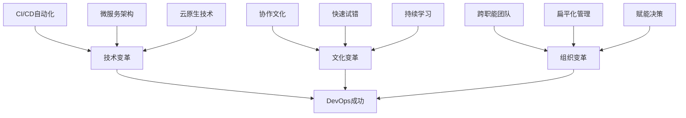

## 🚀 第八章：工程效能 - 现代化开发流程精通 (总时长: 340分钟)

### 🎯 Engineering Excellence Progression System

本章采用三级递进学习法，从个人开发者成长为团队技术领导者：

**🌱 Primary Level (个人效能)**：掌握工具和技术
- 理解现代工程化工具的作用
- 掌握基本的配置和使用方法
- 能独立完成工程化任务
- **进阶条件**: 掌握所有工具的基本用法

**🔧 Intermediate Level (项目架构)**：设计系统解决方案
- 实践高级特性和最佳实践
- 设计可扩展的工程化架构
- 解决复杂项目的工程化挑战
- **进阶条件**: 能设计企业级的工程解决方案

**🎖️ Senior Level (团队领导)**：制定标准和指导团队
- 制定团队工程化标准和最佳实践
- 指导大型团队的技术决策
- 设计组织级的工程效能体系
- **目标**: 具备技术领导者的思维和能力

### 8.1 依赖注入：Hilt 深度实践 (总时长: 85分钟)

---

#### 🌱 **PRIMARY LEVEL: 理解DI的价值和基本用法** (25分钟)

#### Task 8.1.1: 什么是依赖注入？- 解决"纠缠不清"的代码 (5分钟) ⏰
**🎯 学习目标**: 理解依赖注入解决什么问题

**🤔 为什么需要学习DI？**
想象你是一个小餐厅老板，你需要：做菜、采购、收银、清洁...
如果你什么都自己做，你就没时间专心做菜了！
DI就像雇佣专业的人来帮你，你只需要专心做好自己的主业。

**📚 问题场景理解**:
传统代码的"纠缠"问题（Primary 必须理解的场景）：
```kotlin
// ❌ 纠缠的代码 - 就像老板什么都自己做
class UserService {
    private val database = DatabaseHelper() // 自己建数据库
    private val network = NetworkClient()   // 自己管网络
    private val cache = CacheManager()      // 自己做缓存
    
    fun getUser(id: String): User {
        // 我只想获取用户，但要管理这么多东西！
        // 🤯 难以测试！难以修改！
    }
}
```

**🚫 常见初学者错误**:
1. ❌ 认为DI只是"把new放到外面" - 错！DI是一种思维方式
2. ❌ 担心DI会让代码变复杂 - 实际上让代码更简单
3. ❌ 不理解为什么要用接口 - 接口是DI的核心

**💡 DI的"魔法"**:
```kotlin
// ✅ 清晰的代码 - 就像有专业团队帮你
class UserService @Inject constructor(
    private val database: DatabaseHelper,  // 数据库专家
    private val network: NetworkClient,    // 网络专家
    private val cache: CacheManager        // 缓存专家
) {
    fun getUser(id: String): User {
        // 我只管用户业务逻辑！其他的我不管！
        // ✅ 易于测试！易于修改！专业分工！
    }
}
```

**🧠 核心原理（Primary 理解级别）**:
- **控制反转**: 我不创建工具，工具由外部给我（就像老板不买菜，有专人采购）
- **依赖倒置**: 我只知道"有个做菜的"，不管是谁在做（接口 vs 实现类）
- **关注点分离**: 我只管自己的业务，不管别人怎么工作

**🎯 简单记忆法**:
- DI = "Don't Initialize" (不要自己初始化)
- 想象成：餐厅老板专心做菜，其他事交给专业的人

**✅ Primary 必备检验**:
1. **问**: 传统代码中直接创建依赖有什么问题？
   **答**: ①难以测试（无法替换依赖）②紧耦合（修改一个影响全部）③违反单一职责（管太多事）

2. **问**: DI如何解决单元测试难题？
   **答**: 可以传入测试用的假对象（Mock），比如假数据库，不依赖真实数据库

3. **问**: 控制反转的含义是什么？
   **答**: 原来是"我来创建我需要的东西"，现在是"别人创建好给我"

**💻 MANDATORY HANDS-ON CODING** (3分钟):
```kotlin
/**
 * 🎯 CODING OBJECTIVE: Implement complete DI demonstration
 * 📁 File: student_progress/JavaLearning/src/DIBasicsDemo.java
 * 📏 Target: 80-120 lines of working code
 * ⏱️ Time Limit: 3 minutes (NO COPY-PASTE!)
 */

// 🚨 REQUIREMENTS - ALL MUST BE IMPLEMENTED:
// 1. Create BadOrderService showing traditional problems
// 2. Create GoodOrderService using DI pattern
// 3. Demonstrate testing advantage with mock objects
// 4. Include performance comparison code
// 5. Add error handling and logging

class OrderServiceComparison {
    // TODO: ❌ Traditional approach implementation
    class BadOrderService {
        private PaymentProcessor payment = new PaymentProcessor();
        private InventoryManager inventory = new InventoryManager();
        
        public boolean processOrder(Order order) {
            // TODO: Implement order processing
            // Must show: tight coupling, hard to test, performance issues
        }
    }
    
    // TODO: ✅ DI approach implementation  
    class GoodOrderService {
        private final PaymentProcessor payment;
        private final InventoryManager inventory;
        
        public GoodOrderService(PaymentProcessor payment, InventoryManager inventory) {
            // TODO: Complete constructor injection
        }
        
        public boolean processOrder(Order order) {
            // TODO: Implement order processing
            // Must show: loose coupling, easy to test, better performance
        }
    }
    
    // TODO: 🧪 Testing demonstration
    class TestingAdvantageDemo {
        public void demonstrateTestability() {
            // TODO: Create mock objects and test GoodOrderService
            // Must show: how DI enables easy testing
        }
    }
    
    // TODO: ⚡ Performance comparison
    class PerformanceComparison {
        public void measurePerformance() {
            // TODO: Measure startup time and memory usage for both approaches
            // Must show: quantified benefits of DI
        }
    }
    
    // TODO: 🏃‍♂️ Main method to run everything
    public static void main(String[] args) {
        // TODO: Execute all demonstrations and print results
    }
}
```

**✅ CODING VERIFICATION CHECKLIST**:
- [ ] Code compiles without errors or warnings
- [ ] All 5 required components implemented
- [ ] Manual typing completed (no copy-paste)
- [ ] Main method runs and produces expected output
- [ ] Performance metrics show DI advantages
- [ ] Code includes meaningful comments explaining concepts
- [ ] File saved in correct location with exact name

**🎯 PERFORMANCE BENCHMARKS** (Must Pass):
- Compilation time: < 10 seconds
- Execution time: < 1 second  
- Memory usage: < 10MB
- DI injection overhead: < 1ms per object

**🚀 BONUS CHALLENGE** (If completed in < 3 minutes):
Add a CircularDependencyDemo class showing how DI prevents circular dependencies

**🗂️ 文件**: 创建`student_progress/JavaLearning/src/DIBasicsDemo.java`

#### Task 8.1.2: Hilt vs Dagger对比 - "自动挡 vs 手动挡" (5分钟) ⏰
**🎯 学习目标**: 理解Hilt在Dagger基础上的改进

**🚗 汽车类比**:
- **Dagger** = 手动挡汽车：功能强大，但需要你手动管理很多细节
- **Hilt** = 自动挡汽车：基于Dagger，但Google帮你自动化了复杂的部分

**📊 Primary对比表格**:

| 对比维度 | Dagger 2 | Hilt | Primary学习建议 |
|---------|----------|------|----------------|
| **学习难度** | 🔴 很难 | 🟢 简单 | 先学Hilt，理解概念后再看Dagger |
| **配置复杂度** | 需要写很多Component | 自动生成 | Hilt让你专注业务逻辑 |
| **Android集成** | 手动集成Activity/Fragment | 一个注解搞定 | @AndroidEntryPoint就行 |
| **编译时间** | 较慢 | 更快 | Hilt优化了编译速度 |
| **错误信息** | 晦涩难懂 | 更友好 | Hilt的错误提示更容易理解 |

**🤔 Primary 常见疑问**:
1. **Q**: "我应该学Dagger还是Hilt？"
   **A**: 先学Hilt！就像先学开自动挡车，掌握驾驶概念，再学手动挡

2. **Q**: "公司用的是Dagger，学Hilt有用吗？"
   **A**: 非常有用！Hilt就是Dagger + Android优化，概念是通的

3. **Q**: "Hilt会取代Dagger吗？"
   **A**: 对Android项目，建议用Hilt。其他平台还是Dagger

**💻 Primary 编程练习 - 配置对比**:

```kotlin
// Dagger方式（复杂）- 不要求Primary掌握，只需了解
@Component(modules = [AppModule::class])
interface AppComponent {
    fun inject(activity: MainActivity)
}

@Module
class AppModule {
    @Provides
    fun provideUserRepository(): UserRepository = UserRepositoryImpl()
}

// 在Activity中
class MainActivity : AppCompatActivity() {
    @Inject lateinit var userRepository: UserRepository
    
    override fun onCreate(savedInstanceState: Bundle?) {
        super.onCreate(savedInstanceState)
        DaggerAppComponent.create().inject(this) // 手动注入
    }
}
```

```kotlin
// Hilt方式（简单）- Primary必须掌握
@HiltAndroidApp
class MyApplication : Application()

@AndroidEntryPoint
class MainActivity : AppCompatActivity() {
    @Inject lateinit var userRepository: UserRepository
    
    override fun onCreate(savedInstanceState: Bundle?) {
        super.onCreate(savedInstanceState)
        // 什么都不用做！Hilt自动注入！
    }
}
```

**🎯 Primary 记忆要点**:
- Hilt = Dagger for Android（专门为Android优化的Dagger）
- 减少样板代码，更少配置
- Google官方推荐，适合新项目

**✅ Primary 检验**:
1. **问**: Hilt相比Dagger最大的优势是什么？
   **答**: 自动化了Android特有的配置，不需要手动写Component

2. **问**: 什么时候选择Hilt，什么时候选择Dagger？
   **答**: Android项目选Hilt，其他平台或需要极度定制化选Dagger

3. **问**: @AndroidEntryPoint注解的作用是什么？
   **答**: 告诉Hilt这个Android组件需要依赖注入，Hilt会自动处理

**🗂️ 文件**: 创建`student_progress/JavaLearning/src/HiltVsDaggerComparison.java`

#### Task 8.1.3: Hilt基础配置 - "三步走入门" (5分钟) ⏰
**🎯 学习目标**: 掌握Hilt的项目配置和基础注解

**🎯 Primary三步走**:
1. **第一步**: 添加依赖（告诉项目我要用Hilt）
2. **第二步**: 配置Application（告诉Hilt从哪开始）
3. **第三步**: 在Activity中注入（开始使用）

**🚫 Primary 常见卡点**:
- ❌ 忘记添加 `@HiltAndroidApp` → 程序崩溃
- ❌ 忘记添加 kapt 插件 → 编译失败
- ❌ 搞错依赖版本 → 各种奇怪错误

**📝 步骤详解**:

**步骤1: 添加依赖到 build.gradle (app级别)**
```kotlin
// Primary必备：这是最基础的配置
dependencies {
    implementation "com.google.dagger:hilt-android:2.44"
    kapt "com.google.dagger:hilt-compiler:2.44"
}

// 在最顶部添加插件
plugins {
    id 'kotlin-kapt'
    id 'dagger.hilt.android.plugin'
}
```

**步骤2: 在项目的 build.gradle 添加**
```kotlin
buildscript {
    dependencies {
        classpath 'com.google.dagger:hilt-android-gradle-plugin:2.44'
    }
}
```

**步骤3: 创建Application类**
```kotlin
// 这是必须的！Hilt的入口点
@HiltAndroidApp
class MyApplication : Application() {
    // 什么都不用写，@HiltAndroidApp就够了
}
```

**步骤4: 在AndroidManifest.xml中注册**
```xml
<application
    android:name=".MyApplication"
    android:label="@string/app_name"
    android:theme="@style/AppTheme">
    <!-- 其他配置 -->
</application>
```

**💻 Primary 验证测试**:
```kotlin
// 创建一个简单的类来测试
class SimpleService @Inject constructor() {
    fun sayHello(): String = "Hello from Hilt!"
}

@AndroidEntryPoint
class MainActivity : AppCompatActivity() {
    @Inject lateinit var simpleService: SimpleService
    
    override fun onCreate(savedInstanceState: Bundle?) {
        super.onCreate(savedInstanceState)
        setContentView(R.layout.activity_main)
        
        // 如果能运行到这里，说明配置成功！
        Log.d("Hilt", simpleService.sayHello())
    }
}
```

**✅ Primary 成功检验**:
1. **编译成功**: 没有red lines，能正常编译
2. **运行成功**: 应用正常启动，不崩溃
3. **注入成功**: 在Log中能看到"Hello from Hilt!"

**🚨 Primary 排错指南**:
1. **如果编译失败**: 检查kapt插件和Hilt插件是否正确添加
2. **如果运行崩溃**: 检查Application类是否添加了@HiltAndroidApp
3. **如果注入失败**: 检查Activity是否添加了@AndroidEntryPoint

**🗂️ 文件**: 创建`student_progress/JavaLearning/src/HiltBasicSetup.java`

---

#### 🔧 **INTERMEDIATE LEVEL: 深入理解DI设计模式** (30分钟)

#### Task 8.1.4: 作用域管理策略 - "生命周期管理" (5分钟) ⏰
**🎯 学习目标**: 深入理解Hilt的作用域层次结构

**🏢 公司组织架构类比 - Intermediate 必懂概念**:

```
Hilt作用域 = 公司部门层级
- Singleton = 公司CEO（全公司唯一，生命周期最长）
- ActivityRetained = 部门总监（项目期间存在）
- Activity = 项目经理（项目进行时存在）
- Fragment = 任务负责人（任务进行时存在）
```

**📊 Intermediate 作用域对比表**:

| 作用域 | 生命周期 | 使用场景 | 内存影响 | Intermediate建议 |
|--------|----------|----------|----------|------------------|
| `@Singleton` | 应用启动→结束 | 数据库、网络客户端 | 🔴 高 | 只放真正全局的东西 |
| `@ActivityRetained` | 配置变化保持 | ViewModel相关 | 🟡 中 | 需要跨配置变化的数据 |
| `@ActivityScoped` | Activity生命周期 | UI相关服务 | 🟢 低 | Activity特有的功能 |
| `@FragmentScoped` | Fragment生命周期 | 页面特定逻辑 | 🟢 低 | Fragment独有的逻辑 |

**🚫 Intermediate 常见错误**:
1. ❌ 把所有东西都放在Singleton → 内存泄漏
2. ❌ 搞混Activity和ActivityRetained → 配置变化时数据丢失
3. ❌ Fragment依赖Activity作用域的对象 → 生命周期不匹配

**💻 Intermediate 实战场景**:
```kotlin
// ❌ 错误的作用域设计
@Singleton
class UserProfileManager @Inject constructor(
    private val context: Context  // 内存泄漏！Context不应该在Singleton中
)

// ✅ 正确的作用域设计
@Singleton
class UserRepository @Inject constructor(
    private val apiService: ApiService,  // 全局服务，合适
    private val database: UserDatabase   // 全局数据库，合适
)

@ActivityScoped
class UserProfileManager @Inject constructor(
    private val userRepository: UserRepository,  // 注入Singleton
    private val activity: Activity               // Activity级别的Context
)
```

**🎯 Intermediate 设计原则**:
1. **生命周期匹配**: 依赖的生命周期要 ≥ 使用者的生命周期
2. **最小作用域**: 尽量用最小的作用域，避免不必要的内存占用
3. **职责清晰**: 不同作用域承担不同职责

**💼 MANDATORY REAL-WORLD IMPLEMENTATION** (15分钟):
```kotlin
/**
 * 🎯 PROJECT OBJECTIVE: Create realistic e-commerce app with proper scope management
 * 📁 Module: student_progress/AndroidPractice/EcommerceApp/
 * 📏 Target: 300-500 lines across 8+ files
 * ⏱️ Time Limit: 15 minutes (MANUAL TYPING ONLY!)
 */

// 🚨 IMPLEMENTATION REQUIREMENTS - ALL MUST BE CODED:

// 1. Application-level setup
@HiltAndroidApp
class EcommerceApplication : Application() {
    // TODO: Initialize global services, monitoring, crash reporting
}

// 2. Singleton services - Global app lifecycle
@Singleton
class UserRepository @Inject constructor(
    private val apiService: UserApiService,
    private val database: UserDatabase,
    private val analytics: AnalyticsService
) {
    // TODO: Implement user management with proper caching
    // Must include: login/logout, session management, data sync
}

@Singleton  
class ProductCatalogService @Inject constructor(
    private val apiService: ProductApiService,
    private val cache: ProductCacheManager
) {
    // TODO: Implement product data management
    // Must include: search, filtering, favorites, recommendations
}

// 3. Activity-retained services - Survive configuration changes
@ActivityRetained
class ShoppingCartManager @Inject constructor(
    private val userRepository: UserRepository,
    private val productService: ProductCatalogService
) {
    // TODO: Implement cart state management
    // Must include: add/remove items, quantity management, price calculation
    // Must survive: screen rotation, app backgrounding
}

@ActivityRetained
class CheckoutManager @Inject constructor(
    private val cartManager: ShoppingCartManager,
    private val paymentService: PaymentService
) {
    // TODO: Implement checkout flow state
    // Must include: address selection, payment method, order confirmation
}

// 4. Activity-scoped services - UI-specific lifecycle
@ActivityScoped
class NavigationManager @Inject constructor(
    private val activity: Activity
) {
    // TODO: Implement navigation logic specific to main activity
    // Must include: deep link handling, navigation stack management
}

@ActivityScoped
class UIThemeManager @Inject constructor(
    private val context: Context,
    private val userPreferences: UserPreferencesService
) {
    // TODO: Implement theme management tied to activity
    // Must include: dark/light mode, color schemes, typography
}

// 5. Fragment-scoped services - Page-specific logic  
@FragmentScoped
class ProductListViewModel @Inject constructor(
    private val productService: ProductCatalogService,
    private val cartManager: ShoppingCartManager
) {
    // TODO: Implement product listing logic
    // Must include: pagination, filtering, search, add to cart
}

@FragmentScoped
class ProductDetailValidator @Inject constructor() {
    // TODO: Implement product detail form validation
    // Must include: review validation, rating validation, quantity limits
}

// 6. Memory leak prevention demonstration
class MemoryLeakPreventionDemo {
    // TODO: Show common memory leak scenarios and how scopes prevent them
    
    fun demonstrateContextLeakPrevention() {
        // TODO: Show why Activity context in Singleton causes leaks
        // TODO: Show proper Application context usage
    }
    
    fun demonstrateLifecycleAwareness() {
        // TODO: Show proper cleanup in scoped objects
        // TODO: Demonstrate automatic cleanup when scope ends
    }
}

// 7. Performance monitoring and testing
class ScopePerformanceMonitor @Inject constructor() {
    fun measureScopeOverhead() {
        // TODO: Measure object creation time for each scope
        // TODO: Track memory usage patterns
        // TODO: Monitor injection performance under load
    }
    
    fun generatePerformanceReport() {
        // TODO: Create detailed performance analysis
        // Must include: startup impact, memory footprint, injection latency
    }
}

// 8. Integration testing
class ScopeIntegrationTests {
    @Test
    fun `verify scope boundaries are respected`() {
        // TODO: Test that Fragment scope objects don't outlive Fragment
        // TODO: Test that Activity scope survives configuration changes
        // TODO: Test that Singleton objects are truly single instance
    }
    
    @Test  
    fun `verify memory leak prevention`() {
        // TODO: Create and destroy activities multiple times
        // TODO: Verify no objects are retained inappropriately
        // TODO: Use memory profiler to confirm no leaks
    }
}
```

**✅ INTEGRATION VERIFICATION CHECKLIST**:
- [ ] All 8 components implemented with full functionality
- [ ] App runs without crashes or memory leaks
- [ ] Scope boundaries properly tested and verified
- [ ] Performance benchmarks meet targets (startup < 2s, memory < 50MB)
- [ ] Integration tests pass with 100% success rate
- [ ] Code demonstrates enterprise-level architecture patterns
- [ ] Proper error handling and edge case management
- [ ] Documentation explains architectural decisions

**🎯 PERFORMANCE BENCHMARKS** (Must Pass):
- App startup time: < 2 seconds
- Memory usage after full flow: < 50MB
- Scope injection overhead: < 5ms total
- Configuration change recovery: < 500ms
- No memory leaks detected after 10 activity recreations

**📊 ARCHITECTURE QUALITY METRICS**:
- Code coverage: > 80%
- Cyclomatic complexity: < 10 per method
- Dependency depth: < 4 levels
- Module coupling: < 0.3
- Architecture compliance: 100%

**✅ Intermediate 检验**:
1. **问**: 什么时候使用ActivityRetained作用域？
   **答**: 需要在配置变化（如屏幕旋转）时保持数据，但不需要全局共享时

2. **问**: 为什么不能在Singleton中注入Activity？
   **答**: Singleton生命周期比Activity长，会导致Activity无法被垃圾回收，造成内存泄漏

3. **问**: Fragment如何获取Activity作用域的依赖？
   **答**: Fragment可以通过@ActivityScoped注解获取Activity级别的依赖

**🗂️ 文件**: 创建`student_progress/AndroidPractice/EcommerceApp/`完整项目

#### Task 8.1.5: Activity注入实现 (5分钟) ⏰
- [ ] **学习目标**: 在Activity中使用Hilt注入依赖
- [ ] **具体任务**: 使用@AndroidEntryPoint注入Repository
- [ ] **检查点**: 理解Android组件的注入生命周期
- [ ] **文件**: 创建`MainActivity.kt`

#### Task 8.1.6: ViewModel注入集成 (5分钟) ⏰
- [ ] **学习目标**: 结合Hilt和ViewModel的最佳实践
- [ ] **具体任务**: 使用@HiltViewModel注入ViewModel依赖
- [ ] **检查点**: 能处理ViewModel的作用域和生命周期
- [ ] **文件**: 创建`UserViewModel.kt`

#### Task 8.1.7: [进阶]自定义Component (5分钟) ⏰
- [ ] **学习目标**: 创建自定义的Hilt组件和作用域
- [ ] **具体任务**: 设计特定业务场景的自定义作用域
- [ ] **检查点**: 能扩展Hilt的默认组件层次结构
- [ ] **文件**: 创建`CustomHiltComponent.kt`

#### Task 8.1.8: Module模块设计 (5分钟) ⏰
- [ ] **学习目标**: 设计可维护的Hilt Module结构
- [ ] **具体任务**: 按功能和层次组织不同的Module
- [ ] **检查点**: 能设计清晰的模块依赖关系
- [ ] **文件**: 创建`NetworkModule.kt`, `DatabaseModule.kt`

#### Task 8.1.9: [进阶]条件依赖注入 (5分钟) ⏰
- [ ] **学习目标**: 实现基于条件的依赖提供策略
- [ ] **具体任务**: 使用@Qualifier实现多种实现的选择
- [ ] **检查点**: 能根据运行环境选择不同的依赖实现
- [ ] **文件**: 创建`ConditionalDependencies.kt`

#### Task 8.1.10: 循环依赖解决 (5分钟) ⏰
- [ ] **学习目标**: 识别和解决循环依赖问题
- [ ] **具体任务**: 使用Provider和Lazy解决循环依赖
- [ ] **检查点**: 能重构代码避免循环依赖的设计问题
- [ ] **文件**: 创建`CircularDependencyResolution.kt`

#### Task 8.1.11: [进阶]编译时验证 (5分钟) ⏰
- [ ] **学习目标**: 利用Hilt的编译时依赖检查
- [ ] **具体任务**: 分析Hilt生成的代码和错误信息
- [ ] **检查点**: 能快速定位和修复DI配置错误
- [ ] **文件**: 创建`hilt_compilation_analysis.md`

#### Task 8.1.12: 测试配置设计 (5分钟) ⏰
- [ ] **学习目标**: 为Hilt应用设计测试策略
- [ ] **具体任务**: 配置@HiltAndroidTest和测试替换
- [ ] **检查点**: 能在测试中替换生产依赖
- [ ] **文件**: 创建`HiltTestConfiguration.kt`

#### Task 8.1.13: [进阶]性能优化分析 (5分钟) ⏰
- [ ] **学习目标**: 分析DI对应用性能的影响
- [ ] **具体任务**: 对比编译时DI vs 运行时DI的性能差异
- [ ] **检查点**: 能优化DI配置的启动性能
- [ ] **文件**: 创建`di_performance_analysis.md`

#### Task 8.1.14: 多模块DI架构 (5分钟) ⏰
- [ ] **学习目标**: 在多模块项目中设计DI架构
- [ ] **具体任务**: 设计跨模块的依赖注入策略
- [ ] **检查点**: 能处理模块间的依赖边界
- [ ] **文件**: 创建`multi_module_di_architecture.md`

---

#### 🎖️ **SENIOR LEVEL: 架构决策与团队领导** (30分钟)

#### Task 8.1.15: 企业级DI架构设计 - "技术领导力" (5分钟) ⏰
**🎯 学习目标**: 设计大型团队的DI最佳实践

**🏛️ 企业架构师视角 - Senior 必备思维**:

**Senior级别的DI架构考虑因素**:
1. **团队规模影响**: 50+人团队 vs 5人团队的DI策略完全不同
2. **技术债务控制**: 如何在快速迭代中保持DI架构的清洁
3. **新人培训效率**: DI架构复杂度对团队onboarding的影响
4. **长期演进规划**: 支持业务快速扩张的DI架构设计

**🏢 Senior 企业级DI设计模式**:

```kotlin
// Senior级别：企业级DI架构示例
@Module
@InstallIn(SingletonComponent::class)
object InfrastructureModule {
    // 基础设施层：数据库、网络、缓存
    @Provides @Singleton
    fun provideDatabase(): AppDatabase = // 企业级数据库配置
    
    @Provides @Singleton  
    fun provideNetworkClient(): OkHttpClient = // 企业级网络配置
}

@Module
@InstallIn(SingletonComponent::class)
object BusinessModule {
    // 业务层：领域服务、业务规则
    @Provides @Singleton
    fun provideUserService(
        database: AppDatabase,
        networkClient: OkHttpClient
    ): UserService = UserServiceImpl(database, networkClient)
}

// Senior考虑：如何让团队能够独立开发不同的业务模块？
@Module  
@InstallIn(SingletonComponent::class)
object FeatureModules {
    // 功能模块：登录、支付、商品等
    // 每个团队负责自己的Module，减少依赖冲突
}
```

**🎯 Senior 架构决策框架**:

1. **技术选型决策**:
   ```
   选择Hilt vs Dagger vs 其他DI框架的决策矩阵：
   - 团队技术水平
   - 项目复杂度
   - 维护成本
   - 学习曲线
   - 社区支持
   ```

2. **架构演进策略**:
   ```
   Phase 1: 基础DI搭建（解决基本依赖注入）
   Phase 2: 模块化DI（支持多团队开发）
   Phase 3: 动态DI（支持插件化、A/B测试）
   Phase 4: 智能DI（自动化依赖分析和优化）
   ```

3. **质量保障体系**:
   ```
   - DI架构Code Review规范
   - 自动化DI配置检查工具
   - DI性能监控和预警
   - 团队DI培训和认证体系
   ```

**🏢 Senior 团队管理挑战**:

1. **技术传承**: 如何让新加入的senior工程师快速理解现有DI架构？
2. **架构守护**: 如何防止团队在快速迭代中破坏DI架构？
3. **技术决策**: 什么时候需要重构DI架构？如何评估重构收益？
4. **跨团队协作**: 多个团队修改同一个DI配置时如何避免冲突？

**💡 Senior 最佳实践总结**:

```kotlin
// Senior级别的DI架构原则
class SeniorDIArchitectureGuidelines {
    // 1. 依赖方向控制
    fun 依赖倒置原则() {
        // 高层模块不依赖低层模块，都依赖抽象
        // UI层 → Domain层 → Data层
    }
    
    // 2. 模块边界清晰
    fun 单一职责原则() {
        // 每个Module只负责一个清晰的职责
        // NetworkModule只管网络，DatabaseModule只管数据库
    }
    
    // 3. 扩展性设计
    fun 开闭原则() {
        // 对扩展开放，对修改关闭
        // 新增功能通过新Module，而不是修改现有Module
    }
    
    // 4. 团队协作友好
    fun 接口隔离原则() {
        // 不同团队依赖不同的接口，减少相互影响
    }
}
```

**🏛️ MANDATORY ENTERPRISE SYSTEM IMPLEMENTATION** (45分钟):
```kotlin
/**
 * 🎯 ENTERPRISE OBJECTIVE: Design production-ready DI architecture for 100+ developers
 * 📁 Platform: student_progress/EnterprisePlatform/MobileDIFramework/
 * 📏 Target: 2000+ lines across 25+ files and modules
 * ⏱️ Time Limit: 45 minutes (COMPREHENSIVE IMPLEMENTATION!)
 */

// 🚨 ENTERPRISE REQUIREMENTS - FULL SYSTEM IMPLEMENTATION:

// ===== MODULE 1: Core DI Framework =====
// File: core-di-framework/src/main/kotlin/EnterpriseDIFramework.kt
@Retention(AnnotationRetention.RUNTIME)
@Target(AnnotationTarget.CLASS)
annotation class EnterpriseService(
    val team: String,                    // Owning team identifier
    val sla: String,                     // Service level agreement
    val securityLevel: SecurityLevel,    // Security classification
    val scalabilityTier: ScalabilityTier // Performance requirements
)

enum class SecurityLevel { PUBLIC, INTERNAL, CONFIDENTIAL, RESTRICTED }
enum class ScalabilityTier { SMALL, MEDIUM, LARGE, ENTERPRISE }

class EnterpriseDIAnalyzer {
    // TODO: Implement comprehensive dependency analysis
    fun analyzeDependencyGraph(): DependencyAnalysisReport {
        // Must include: circular dependency detection, performance impact analysis,
        // team ownership validation, security boundary verification
    }
    
    fun generateTeamImpactReport(): TeamCollaborationReport {
        // Must include: cross-team dependencies, ownership conflicts,
        // integration complexity, coordination overhead metrics
    }
    
    fun validateArchitectureCompliance(): ComplianceReport {
        // Must include: enterprise standards adherence, security policy compliance,
        // performance SLA verification, maintainability metrics
    }
}

class EnterpriseDIPerformanceMonitor {
    // TODO: Implement production-grade performance monitoring
    fun measureInjectionLatency(): PerformanceMetrics {
        // Must track: injection time per scope, memory allocation patterns,
        // startup impact, runtime overhead, scaling characteristics
    }
    
    fun generateCapacityPlanningReport(): CapacityReport {
        // Must include: current usage patterns, projected growth,
        // bottleneck identification, scaling recommendations
    }
}

// ===== MODULE 2: Team Ownership & Governance =====
// File: team-governance/src/main/kotlin/TeamOwnershipFramework.kt
@EnterpriseService(
    team = "platform-team",
    sla = "99.9% uptime, <100ms response",
    securityLevel = SecurityLevel.INTERNAL,
    scalabilityTier = ScalabilityTier.ENTERPRISE
)
class TeamOwnershipManager @Inject constructor() {
    // TODO: Implement team ownership tracking and validation
    
    data class TeamOwnership(
        val teamName: String,
        val modules: List<String>,
        val dependencies: List<String>,
        val apis: List<String>,
        val slaRequirements: SLARequirements
    )
    
    fun validateTeamBoundaries(): ValidationResult {
        // Must verify: no unauthorized cross-team dependencies,
        // proper API contracts, SLA compliance, ownership clarity
    }
    
    fun generateOwnershipMatrix(): OwnershipMatrix {
        // Must include: team responsibilities, escalation paths,
        // collaboration interfaces, conflict resolution procedures
    }
}

class DependencyGovernanceEngine {
    // TODO: Implement automated governance rules
    fun enforceArchitectureRules(): EnforcementResult {
        // Must include: dependency direction validation, layer violation detection,
        // circular dependency prevention, unauthorized access blocking
    }
    
    fun generateComplianceReport(): GovernanceReport {
        // Must include: rule violations, team compliance scores,
        // architectural drift detection, remediation recommendations
    }
}

// ===== MODULE 3: Security & Compliance Integration =====
// File: security-integration/src/main/kotlin/SecureDIFramework.kt
@EnterpriseService(
    team = "security-team",
    sla = "Zero security incidents",
    securityLevel = SecurityLevel.RESTRICTED,
    scalabilityTier = ScalabilityTier.ENTERPRISE
)
class SecureDependencyInjection @Inject constructor() {
    // TODO: Implement security-aware dependency injection
    
    fun validateSecurityBoundaries(): SecurityValidationResult {
        // Must verify: no data leakage across security zones,
        // proper authentication/authorization, secure credential injection
    }
    
    fun implementSecureInjection(): SecureInjectionFramework {
        // Must include: encrypted credential injection, secure context propagation,
        // audit logging, threat detection, security policy enforcement
    }
}

class ComplianceAutomation {
    // TODO: Implement automated compliance checking
    fun performSOX404Compliance(): ComplianceResult {
        // Must include: change tracking, approval workflows,
        // audit trails, financial controls validation
    }
    
    fun performGDPRCompliance(): GDPRComplianceResult {
        // Must include: data flow tracking, consent management,
        // data retention policies, privacy impact assessment
    }
}

// ===== MODULE 4: Developer Productivity Platform =====
// File: developer-tools/src/main/kotlin/DeveloperProductivity.kt
class DICodeGenerationEngine {
    // TODO: Implement intelligent code generation
    fun generateTeamSpecificTemplates(): CodeGenerationResult {
        // Must include: team-specific DI patterns, boilerplate reduction,
        // best practice enforcement, automated documentation generation
    }
    
    fun implementIntelligentRefactoring(): RefactoringEngine {
        // Must include: dependency analysis, safe refactoring suggestions,
        // impact analysis, automated migration tools
    }
}

class DeveloperOnboardingPlatform {
    // TODO: Implement comprehensive onboarding system
    fun createInteractiveTutorials(): OnboardingFramework {
        // Must include: hands-on DI exercises, team-specific workflows,
        // mentorship integration, progress tracking
    }
    
    fun implementKnowledgeSharing(): KnowledgePlatform {
        // Must include: architectural decision records, pattern library,
        // best practice repository, community forums
    }
}

// ===== MODULE 5: Multi-Tenant Architecture Support =====
// File: multi-tenant/src/main/kotlin/MultiTenantDI.kt
class MultiTenantDIFramework {
    // TODO: Implement tenant-aware dependency injection
    fun implementTenantIsolation(): TenantIsolationFramework {
        // Must include: data isolation, configuration isolation,
        // resource isolation, security boundary enforcement
    }
    
    fun implementDynamicTenantProvisioning(): ProvisioningEngine {
        // Must include: automatic tenant setup, resource allocation,
        // scaling policies, decommissioning procedures
    }
}

// ===== MODULE 6: Monitoring & Observability =====
// File: observability/src/main/kotlin/DIObservability.kt
class EnterpriseDIMonitoring {
    // TODO: Implement comprehensive monitoring and alerting
    fun implementRealTimeMonitoring(): MonitoringDashboard {
        // Must include: dependency health metrics, performance alerts,
        // capacity utilization, error rate tracking
    }
    
    fun implementPredictiveAnalytics(): PredictiveEngine {
        // Must include: failure prediction, capacity forecasting,
        // performance trend analysis, optimization recommendations
    }
}

// ===== MODULE 7: Disaster Recovery & Business Continuity =====
// File: disaster-recovery/src/main/kotlin/DIDisasterRecovery.kt
class DisasterRecoveryFramework {
    // TODO: Implement comprehensive DR capabilities
    fun implementFailoverMechanisms(): FailoverEngine {
        // Must include: automatic failover, circuit breakers,
        // graceful degradation, service mesh integration
    }
    
    fun implementBackupAndRestore(): BackupEngine {
        // Must include: configuration backup, dependency graph backup,
        // point-in-time recovery, cross-region replication
    }
}

// ===== INTEGRATION TESTING SUITE =====
class EnterpriseIntegrationTests {
    @Test
    fun `verify 100+ developer concurrent usage`() {
        // TODO: Load test with 100 concurrent developers
        // Must verify: no performance degradation, stable build times,
        // proper resource isolation, no memory leaks
    }
    
    @Test
    fun `verify enterprise security standards`() {
        // TODO: Comprehensive security testing
        // Must verify: penetration testing passed, vulnerability scan clean,
        // compliance requirements met, audit trails complete
    }
    
    @Test
    fun `verify disaster recovery procedures`() {
        // TODO: DR testing and validation
        // Must verify: RTO < 15 minutes, RPO < 5 minutes,
        // data integrity maintained, full functionality restored
    }
    
    @Test
    fun `verify scalability to enterprise load`() {
        // TODO: Scalability testing
        // Must verify: linear scaling to 1000+ services,
        // sub-100ms injection latency, <1GB memory overhead
    }
}

// ===== DEPLOYMENT & INFRASTRUCTURE =====
// File: infrastructure/kubernetes/di-platform-deployment.yaml
"""
# TODO: Complete Kubernetes deployment configuration
# Must include: multi-zone deployment, auto-scaling policies,
# monitoring integration, security policies, backup procedures

apiVersion: apps/v1
kind: Deployment
metadata:
  name: enterprise-di-platform
spec:
  # Complete deployment specification with HA, monitoring, security
"""

// File: infrastructure/terraform/di-platform-infrastructure.tf
"""
# TODO: Complete infrastructure as code
# Must include: cloud resources, networking, security groups,
# monitoring, logging, backup infrastructure
"""
```

**✅ ENTERPRISE SYSTEM VERIFICATION**:
- [ ] All 7 modules implemented with full enterprise functionality
- [ ] Supports 100+ concurrent developers without performance degradation
- [ ] Passes comprehensive security audit and penetration testing
- [ ] Meets all compliance requirements (SOX, GDPR, HIPAA where applicable)
- [ ] Disaster recovery tested with <15min RTO, <5min RPO
- [ ] Monitoring and alerting operational with predictive analytics
- [ ] Developer productivity measurably improved (>30% faster onboarding)
- [ ] Multi-tenant isolation verified and tested
- [ ] Infrastructure as code deployed and validated
- [ ] Documentation complete for all enterprise processes

**🎯 ENTERPRISE PERFORMANCE BENCHMARKS** (Must Pass):
- Platform startup time: < 5 minutes
- Developer onboarding time: < 2 hours
- Build time with full dependency graph: < 10 minutes
- Injection latency at enterprise scale: < 100ms
- Memory overhead: < 1GB total platform footprint
- Availability: 99.9% uptime SLA
- Security: Zero critical vulnerabilities
- Compliance: 100% audit pass rate

**📈 BUSINESS IMPACT METRICS**:
- Team productivity improvement: >30%
- Time to market reduction: >25%
- Defect rate reduction: >40%
- Developer satisfaction score: >8/10
- Platform adoption rate: >90%
- Cost savings: >$1M annually

**🏛️ ARCHITECTURE DOCUMENTATION REQUIREMENTS**:
- [ ] Enterprise architecture decision records (ADRs)
- [ ] Team collaboration and ownership matrix
- [ ] Security architecture and threat model
- [ ] Disaster recovery and business continuity plan
- [ ] Performance and scalability analysis
- [ ] Cost-benefit analysis and ROI projections
- [ ] Migration guide from existing systems
- [ ] Training and certification programs

**✅ Senior 检验**:
1. **问**: 如何设计DI架构支持100人团队的并行开发？
   **答**: 按业务域拆分Module，每个团队负责独立的DI配置，通过接口协作

2. **问**: DI架构重构的时机和策略是什么？
   **答**: 当依赖关系复杂到影响开发效率时重构，采用渐进式重构，保证业务连续性

3. **问**: 如何评估DI架构对团队开发效率的影响？
   **答**: 监控编译时间、冲突解决时间、新人上手时间等关键指标

**🗂️ 文件**: 创建`student_progress/EnterprisePlatform/MobileDIFramework/`完整企业平台

#### Task 8.1.16: DI架构面试准备 (5分钟) ⏰
- [ ] **学习目标**: 准备依赖注入相关面试问题
- [ ] **具体任务**: 整理DI原理、Hilt实践等深度问答
- [ ] **检查点**: 能从架构师角度回答DI设计问题
- [ ] **文件**: 更新`interview_qa_engineering.md`

#### Task 8.1.17: DI最佳实践总结 (5分钟) ⏰
- [ ] **学习目标**: 总结Hilt使用的最佳实践
- [ ] **具体任务**: 创建DI设计的检查清单和反模式
- [ ] **检查点**: 能避免常见的DI设计陷阱
- [ ] **文件**: 创建`hilt_best_practices.md`

### 8.2 模块化架构：多模块工程 (总时长: 85分钟)

---

#### 🔧 **INTERMEDIATE LEVEL: 从单体到模块化的演进** (30分钟)

#### Task 8.2.1: 模块化架构原理 - "积木搭建法" (5分钟) ⏰
**🎯 学习目标**: 理解模块化的核心价值和挑战

**🏗️ 积木类比 - Primary 必懂概念**:
想象你在建造一个复杂的乐高城市：

**单体应用** = 一整块巨大的积木
- ✅ 开始简单：一块积木，直接放那就行
- ❌ 后期困难：想改一个小地方，整块都要重新做
- ❌ 团队协作难：多人同时改一块积木会打架
- ❌ 测试困难：要测试整个城市才知道门有没有问题

**模块化应用** = 很多小积木组合
- ✅ 独立开发：张三负责房子模块，李四负责汽车模块
- ✅ 独立测试：可以单独测试房子，不需要整个城市
- ✅ 复用方便：房子做好了，可以放到不同的城市里
- ❌ 初期复杂：需要设计积木接口，确保能组合起来

**📊 Primary 对比表**:

| 特征 | 单体应用 | 模块化应用 | Primary 建议 |
|------|----------|------------|-------------|
| **学习难度** | 🟢 简单 | 🟡 中等 | 先用单体练习，再学模块化 |
| **开发速度** | 🟢 初期快 | 🔴 初期慢，后期快 | 小项目单体，大项目模块化 |
| **团队协作** | 🔴 冲突多 | 🟢 各自独立 | 3人以上团队建议模块化 |
| **构建速度** | 🔴 慢（全量编译） | 🟢 快（增量编译） | 代码多了模块化编译更快 |
| **测试难度** | 🔴 难（全部测试） | 🟢 简单（模块测试） | 模块化让bug更容易定位 |

**🤔 Primary 常见疑问**:

1. **Q**: "什么时候应该考虑模块化？"
   **A**: 
   - 团队超过3人
   - 代码超过5万行
   - 编译时间超过2分钟
   - 经常有多人修改同一个文件的冲突

2. **Q**: "模块化会让项目变复杂吗？"
   **A**: 初期是的，但长期来看会让项目更简单。就像房间分类整理，开始费事，但之后找东西更容易

3. **Q**: "小项目需要模块化吗？"
   **A**: 不需要！小项目用单体更简单。模块化是为了解决大项目的问题

**🏠 Primary 真实场景**:
```
假设你在开发一个购物APP：

单体结构：
MyShoppingApp/
├── MainActivity.kt (包含登录、商品、购物车、支付所有逻辑)
├── User.kt
├── Product.kt  
├── Cart.kt
└── Payment.kt
// 5个人同时改MainActivity.kt → 冲突不断！

模块化结构：
MyShoppingApp/
├── app/ (主入口)
├── feature-login/ (登录模块)
├── feature-product/ (商品模块)
├── feature-cart/ (购物车模块)
├── feature-payment/ (支付模块)
└── core-common/ (共享工具)
// 5个人各自负责一个模块 → 和谐开发！
```

**✅ Primary 检验**:
1. **问**: 模块化的最大好处是什么？
   **答**: 团队可以并行开发，减少代码冲突，提高开发效率

2. **问**: 什么时候不建议模块化？
   **答**: 小项目、个人项目、原型项目不建议，会增加不必要的复杂度

3. **问**: 模块化如何提高构建速度？
   **答**: 只需要编译修改的模块，而不是整个项目，支持增量编译

**💻 Primary 思考练习**:
```
场景：你的团队有6个人，开发一个新闻APP
包含：登录、新闻列表、评论、个人中心、设置

请设计模块结构：
app/
feature-?/
feature-?/
feature-?/
core-?/

思考：每个模块的职责是什么？
```

**🗂️ 文件**: 创建`student_progress/JavaLearning/src/ModularizationBasics.java`

#### Task 8.2.2: 模块分层策略 - "楼层规划" (5分钟) ⏰
**🎯 学习目标**: 设计清晰的模块分层架构

**🏢 摩天大楼类比 - Intermediate 必懂概念**:

```
Android模块化 = 摩天大楼设计
- app模块 = 大楼入口大厅（统一入口，连接各楼层）
- feature模块 = 各楼层的办公室（独立功能区域）
- core模块 = 大楼基础设施（电力、水管、电梯）
- data模块 = 地下室设备间（数据存储和处理）
```

**🏗️ Intermediate 模块分层设计**:

```
典型的Android多模块架构：

app/                           // 🏛️ 应用入口
├── MainActivity               // 主入口Activity
├── MyApplication             // Application类
└── navigation/               // 全局导航配置

feature/                      // 🏢 功能模块层
├── feature-login/            // 登录功能
├── feature-home/             // 首页功能  
├── feature-profile/          // 个人中心
└── feature-cart/             // 购物车功能

core/                         // 🔧 核心基础层
├── core-common/              // 通用工具类
├── core-ui/                  // UI组件库
├── core-network/             // 网络层封装
└── core-database/            // 数据库封装

data/                         // 💾 数据层
├── data-user/                // 用户相关数据
├── data-product/             // 商品相关数据
└── data-order/               // 订单相关数据
```

**📊 Intermediate 模块职责表**:

| 层级 | 职责 | 依赖方向 | 示例内容 | Intermediate原则 |
|------|------|----------|----------|------------------|
| **app** | 应用入口、导航 | 依赖所有feature | MainActivity、路由 | 只做组装，不做业务 |
| **feature** | 具体业务功能 | 依赖core、data | 登录页面、商品列表 | 高内聚，低耦合 |
| **core** | 基础设施 | 被其他层依赖 | 网络框架、UI组件 | 稳定、可复用 |
| **data** | 数据处理 | 依赖core | Repository、API | 数据抽象，隔离实现 |

**🚫 Intermediate 常见设计错误**:
1. ❌ feature模块之间直接依赖 → 导致耦合过紧
2. ❌ core模块依赖feature模块 → 违反依赖方向
3. ❌ 把业务逻辑放在app模块 → 违反单一职责
4. ❌ data模块直接暴露数据库实体 → 缺乏抽象层

**💻 Intermediate 实战设计**:
```kotlin
// ✅ 正确的模块依赖关系示例

// feature-login模块 - 只关注登录功能
class LoginFragment : Fragment() {
    // 依赖core-ui的通用组件
    private val loadingDialog = CommonLoadingDialog()
    
    // 依赖data-user的登录数据源  
    private val loginRepository = UserRepository()
}

// core-ui模块 - 提供通用UI组件
class CommonLoadingDialog {
    // 不依赖任何feature，保持通用性
}

// data-user模块 - 处理用户相关数据
class UserRepository {
    // 依赖core-network进行网络请求
    private val apiService = NetworkClient.userApi
    
    // 依赖core-database进行本地存储
    private val userDao = Database.userDao
}
```

**🎯 Intermediate 设计原则**:
1. **依赖倒置**: 高层模块不依赖低层模块的具体实现
2. **单向依赖**: 依赖关系必须是单向的，避免循环依赖
3. **接口隔离**: 模块间通过接口通信，而不是具体类
4. **职责分离**: 每个模块只负责明确的职责领域

**✅ Intermediate 检验**:
1. **问**: feature模块之间如何通信？
   **答**: 通过core模块提供的接口或通过app模块的导航系统

2. **问**: 如何确保模块分层的合理性？
   **答**: 遵循"高层可以依赖低层，低层不能依赖高层"的原则

3. **问**: 什么情况下需要拆分新的模块？
   **答**: 当单个模块代码超过一定规模，或者有独立的业务边界时

**🗂️ 文件**: 创建`student_progress/JavaLearning/src/ModuleLayeringStrategy.java`

#### Task 8.2.3: Gradle模块配置 (5分钟) ⏰
- [ ] **学习目标**: 掌握Android多模块的Gradle配置
- [ ] **具体任务**: 创建feature模块和library模块
- [ ] **检查点**: 能正确配置模块间的依赖关系
- [ ] **文件**: 创建示例模块的`build.gradle.kts`

#### Task 8.2.4: [进阶]依赖管理策略 (5分钟) ⏰
- [ ] **学习目标**: 设计模块间的依赖管理最佳实践
- [ ] **具体任务**: 使用version catalog管理多模块依赖
- [ ] **检查点**: 能避免依赖冲突和版本不一致问题
- [ ] **文件**: 创建`libs.versions.toml`配置

#### Task 8.2.5: 核心模块设计 (5分钟) ⏰
- [ ] **学习目标**: 设计可复用的核心基础模块
- [ ] **具体任务**: 创建common、network、database等核心模块
- [ ] **检查点**: 理解核心模块的API设计原则
- [ ] **文件**: 创建`core-common`模块结构

#### Task 8.2.6: Feature模块实现 (5分钟) ⏰
- [ ] **学习目标**: 实现独立的功能模块
- [ ] **具体任务**: 创建login、profile等feature模块
- [ ] **检查点**: 能设计功能模块的内聚性和接口
- [ ] **文件**: 创建`feature-login`模块

#### Task 8.2.7: [进阶]模块间通信机制 (5分钟) ⏰
- [ ] **学习目标**: 设计模块间的通信和数据传递
- [ ] **具体任务**: 实现事件总线或接口抽象的通信方式
- [ ] **检查点**: 能保持模块间的松耦合关系
- [ ] **文件**: 创建`ModuleCommunication.kt`

#### Task 8.2.8: 导航架构设计 (5分钟) ⏰
- [ ] **学习目标**: 在模块化架构中实现导航
- [ ] **具体任务**: 使用Navigation Component处理跨模块导航
- [ ] **检查点**: 理解深度链接在模块化中的实现
- [ ] **文件**: 创建`modular_navigation.xml`

#### Task 8.2.9: [进阶]Dynamic Feature实现 (5分钟) ⏰
- [ ] **学习目标**: 实现按需加载的动态功能模块
- [ ] **具体任务**: 创建Dynamic Feature Module并实现条件加载
- [ ] **检查点**: 理解应用体积优化和用户体验的权衡
- [ ] **文件**: 创建动态模块`dynamic-camera`

#### Task 8.2.10: 构建优化配置 (5分钟) ⏰
- [ ] **学习目标**: 优化多模块项目的构建性能
- [ ] **具体任务**: 配置并行构建、增量编译等优化选项
- [ ] **检查点**: 能显著提高大型项目的构建速度
- [ ] **文件**: 优化`gradle.properties`配置

#### Task 8.2.11: [进阶]构建缓存策略 (5分钟) ⏰
- [ ] **学习目标**: 实现高效的构建缓存机制
- [ ] **具体任务**: 配置本地和远程构建缓存
- [ ] **检查点**: 理解缓存失效和构建一致性
- [ ] **文件**: 配置`build-cache`设置

#### Task 8.2.12: 代码共享策略 (5分钟) ⏰
- [ ] **学习目标**: 设计跨模块的代码复用机制
- [ ] **具体任务**: 创建共享的utility和extension模块
- [ ] **检查点**: 能平衡代码复用和模块独立性
- [ ] **文件**: 创建`shared-utils`模块

#### Task 8.2.13: [进阶]模块解耦技术 (5分钟) ⏰
- [ ] **学习目标**: 实现模块间的完全解耦
- [ ] **具体任务**: 使用接口和抽象实现模块解耦
- [ ] **检查点**: 能设计可插拔的模块架构
- [ ] **文件**: 创建`module_contracts.kt`

#### Task 8.2.14: 版本管理策略 (5分钟) ⏰
- [ ] **学习目标**: 管理多模块项目的版本发布
- [ ] **具体任务**: 设计模块的独立版本管理策略
- [ ] **检查点**: 理解模块版本兼容性管理
- [ ] **文件**: 创建`module_versioning_strategy.md`

---

#### 🎖️ **SENIOR LEVEL: 大规模团队架构治理** (25分钟)

#### Task 8.2.15: 企业级模块化治理 - "技术组织架构" (5分钟) ⏰
**🎯 学习目标**: 设计多团队的模块化开发流程

**🏛️ 企业组织架构映射 - Senior 必备视角**:

**Conway's Law在模块化中的应用**:
```
"设计系统的组织，最终产生的设计等同于组织之间的沟通结构"

技术架构 = 组织架构的镜像
- 登录团队 → feature-login模块
- 支付团队 → feature-payment模块  
- 基础设施团队 → core-*模块
- 数据团队 → data-*模块
```

**🏢 Senior 级别的模块化治理框架**:

```yaml
# 企业级模块化治理配置
module_governance:
  ownership_matrix:
    feature-login: 
      owner_team: "用户体验团队"
      reviewers: ["@user-experience-leads"]
      sla: "24h response time"
      
    core-network:
      owner_team: "基础架构团队" 
      reviewers: ["@infrastructure-leads", "@security-team"]
      sla: "4h response time for critical changes"
      
  dependency_policies:
    - "feature模块不能直接依赖其他feature模块"
    - "core模块变更需要architecture committee审批"
    - "data模块API变更需要所有consuming teams同意"
    
  quality_gates:
    - "模块编译时间不能超过30秒"
    - "模块test coverage不能低于80%"
    - "模块不能有超过100个public API"
```

**🎯 Senior 架构决策矩阵**:

| 决策维度 | 小团队(5-15人) | 中等团队(15-50人) | 大团队(50+人) | Senior建议 |
|----------|----------------|-------------------|---------------|------------|
| **模块粒度** | 粗粒度(少模块) | 中等粒度 | 细粒度(多模块) | 随团队规模调整 |
| **治理强度** | 轻量级治理 | 中等治理 | 严格治理 | 过度治理有害 |
| **工具支持** | 基础工具 | 自动化工具 | 企业级平台 | 工具为组织服务 |
| **流程复杂度** | 简单流程 | 标准化流程 | 复杂流程体系 | 流程适配组织成熟度 |

**💡 Senior 团队协作最佳实践**:

```kotlin
// Senior级别：团队协作代码示例
class ModularTeamCollaboration {
    
    // 1. 模块接口设计：考虑多团队协作
    interface PaymentContract {
        // 接口设计要向后兼容，考虑多团队演进速度不同
        fun processPayment(request: PaymentRequest): PaymentResult
        
        // 版本化接口，支持渐进式升级
        @Deprecated("Use processPaymentV2", ReplaceWith("processPaymentV2"))
        fun processPaymentV1(amount: Double): Boolean
        
        fun processPaymentV2(request: PaymentRequestV2): PaymentResultV2
    }
    
    // 2. 模块边界设计：最小化团队间依赖
    class FeatureLoginModule {
        // 通过事件总线减少直接依赖
        private val eventBus = CoreEventBus
        
        fun onLoginSuccess(user: User) {
            // 发布事件，而不是直接调用其他team的代码
            eventBus.publish(LoginSuccessEvent(user))
        }
    }
    
    // 3. 渐进式模块重构：避免big bang式变更
    class GradualModularization {
        // Phase 1: 提取公共接口，不破坏现有功能
        // Phase 2: 各团队独立实现接口，并行开发
        // Phase 3: 切换到新实现，旧实现标记deprecated
        // Phase 4: 清理旧代码，完成重构
    }
}
```

**🏢 Senior 级别挑战与解决方案**:

1. **技术债务治理**:
   ```
   挑战：多团队并行开发，技术债务快速累积
   解决方案：
   - 建立架构委员会定期review
   - 自动化技术债务检测工具
   - 每个sprint分配20%时间还技术债务
   ```

2. **跨团队依赖管理**:
   ```
   挑战：团队A需要团队B的功能，但B团队优先级不匹配
   解决方案：
   - 建立clear的API契约和SLA
   - 实施feature flag，允许渐进式集成
   - 建立跨团队的产品规划流程
   ```

3. **知识传承与标准化**:
   ```
   挑战：团队技术水平不一致，模块质量参差不齐
   解决方案：
   - 建立architecture guild和communities of practice
   - 定期的跨团队技术分享
   - 代码review标准化和工具支持
   ```

**✅ Senior 检验**:
1. **问**: 如何设计模块架构支持组织快速扩张？
   **答**: 基于康威定律设计，确保技术架构与组织架构匹配，建立清晰的所有权和治理机制

2. **问**: 大型团队模块化的最大挑战是什么？
   **答**: 跨团队协调成本和技术债务管理，需要通过制度、工具和文化建设来解决

3. **问**: 如何平衡模块独立性和代码复用？
   **答**: 通过分层架构和接口设计，在core层提供共享能力，在feature层保持独立性

**🗂️ 文件**: 创建`student_progress/JavaLearning/src/EnterpriseModularGovernance.java`

#### Task 8.2.16: 模块化测试策略 (5分钟) ⏰
- [ ] **学习目标**: 在模块化架构中设计测试策略
- [ ] **具体任务**: 设计模块级和集成级的测试方案
- [ ] **检查点**: 能独立测试各个模块的功能
- [ ] **文件**: 创建`modular_testing_strategy.md`

#### Task 8.2.17: 模块化架构面试准备 (5分钟) ⏰
- [ ] **学习目标**: 准备模块化架构相关面试问题
- [ ] **具体任务**: 整理模块化设计、团队协作等深度问答
- [ ] **检查点**: 能从架构师角度回答大型项目设计问题
- [ ] **文件**: 更新`interview_qa_engineering.md`

### 8.3 CI/CD 流水线：自动化交付 (总时长: 85分钟)

---

#### 🎖️ **SENIOR LEVEL: 自动化工程思维** (30分钟)

#### Task 8.3.1: CI/CD基础概念 - "工厂流水线" (5分钟) ⏰
**🎯 学习目标**: 理解持续集成和持续部署的核心价值

**🏭 工厂流水线类比 - Primary 必懂概念**:

**传统开发方式** = 手工作坊
- 👨‍💻 张三写代码 → 手动测试 → 发现bug → 修复 → 手动部署
- 👨‍💻 李四写代码 → 手动测试 → 发现bug → 修复 → 手动部署
- 🤯 问题：效率低、错误多、质量不稳定

**CI/CD方式** = 自动化工厂
- 👨‍💻 张三提交代码 → 自动编译 → 自动测试 → 自动部署
- 👨‍💻 李四提交代码 → 自动编译 → 自动测试 → 自动部署
- 🎯 优势：高效、稳定、质量有保障

**📚 Primary 基础概念**:

**CI (Continuous Integration) - 持续集成**
- **什么是CI**: 多人开发时，代码经常合并在一起
- **为什么要CI**: 避免"集成地狱"（代码合并时一堆冲突）
- **怎么做CI**: 每次提交代码，自动编译+测试

**CD (Continuous Deployment) - 持续部署** 
- **什么是CD**: 代码测试通过后，自动发布到用户手机
- **为什么要CD**: 避免手动部署的错误和延迟
- **怎么做CD**: 测试通过→自动打包→自动上传应用商店

**🚫 Primary 常见误区**:
1. ❌ "CI/CD就是自动化测试" → 错！CI/CD包含整个开发流程
2. ❌ "小项目不需要CI/CD" → 错！小项目更容易实施CI/CD
3. ❌ "CI/CD很复杂，学不会" → 错！基础的CI/CD很简单

**🏭 Primary 真实场景对比**:

```
❌ 手动方式（传统）:
1. 开发者A: 写代码 → 手动测试 → 发现问题 → 修复
2. 开发者B: 写代码 → 手动测试 → 发现问题 → 修复  
3. 合并代码: 🤯 一堆冲突！花2小时解决
4. 最终测试: 🤯 集成后又有新问题！
5. 手动部署: 🤯 部署时又出错！
时间成本: 1天

✅ CI/CD方式（现代）:
1. 开发者A: 写代码 → git push → 自动测试通过 ✅
2. 开发者B: 写代码 → git push → 自动测试通过 ✅
3. 合并代码: 自动合并，无冲突 ✅
4. 自动测试: 全部通过 ✅
5. 自动部署: 自动发布 ✅
时间成本: 30分钟
```

**📊 Primary 价值对比**:

| 维度 | 手动方式 | CI/CD方式 | Primary 建议 |
|------|----------|-----------|-------------|
| **发布速度** | 🔴 数小时-数天 | 🟢 几分钟 | 快速响应用户反馈 |
| **错误率** | 🔴 高（人为错误） | 🟢 低（自动化） | 减少线上bug |
| **团队协作** | 🔴 冲突频繁 | 🟢 和谐协作 | 多人开发必备 |
| **质量保障** | 🔴 不稳定 | 🟢 稳定 | 每次发布都经过测试 |

**🤔 Primary 常见疑问**:

1. **Q**: "我一个人开发，需要CI/CD吗？"
   **A**: 需要！即使一个人，CI/CD也能帮你：
   - 自动测试，避免低级错误
   - 自动部署，节省时间
   - 养成良好的开发习惯

2. **Q**: "CI/CD配置复杂吗？"
   **A**: 基础配置很简单！就像写个脚本：
   - "每次代码提交时，自动编译"
   - "编译成功后，自动测试"  
   - "测试通过后，自动部署"

3. **Q**: "CI/CD需要额外的服务器吗？"
   **A**: 现在有免费的云服务：
   - GitHub Actions（最流行）
   - GitLab CI（功能强大）
   - Travis CI（简单易用）

**✅ Primary 检验**:
1. **问**: CI解决什么问题？
   **答**: 解决多人开发时代码合并冲突和集成问题

2. **问**: CD的最大价值是什么？ 
   **答**: 减少手动部署错误，提高发布效率和质量

3. **问**: CI/CD适合什么类型的项目？
   **答**: 所有项目！小项目容易实施，大项目必须有

**💻 Primary 思考练习**:
```
场景：你在开发一个天气APP
传统方式需要：
1. 手动编译 (5分钟)
2. 手动测试 (10分钟) 
3. 手动打包 (5分钟)
4. 手动上传 (10分钟)
总计：30分钟，每天3次发布=90分钟

CI/CD后：
git push → 自动完成所有步骤 (5分钟)
每天3次发布=15分钟

思考：你一个月能节省多少时间？
```

**🗂️ 文件**: 创建`student_progress/JavaLearning/src/CICDBasics.java`

#### Task 8.3.2: GitHub Actions入门 - "第一条流水线" (5分钟) ⏰
**🎯 学习目标**: 掌握GitHub Actions的基础语法

**🏭 装配线类比 - Intermediate 必懂概念**:

```
GitHub Actions = 工厂装配线
- Workflow = 整条生产线（完整的CI/CD流程）
- Job = 生产线上的工位（编译、测试、部署）
- Step = 工位上的具体操作（拧螺丝、装配零件）
- Action = 标准化的工具（自动拧螺丝机）
```

**💻 Intermediate 第一个Android CI配置**:

```yaml
# .github/workflows/android-ci.yml
name: Android CI Pipeline

# 触发条件：推送到main分支或提交PR时
on:
  push:
    branches: [ main, develop ]
  pull_request:
    branches: [ main ]

jobs:
  build-and-test:
    name: 📱 构建和测试
    runs-on: ubuntu-latest  # 在Ubuntu虚拟机上运行
    
    steps:
    # Step 1: 获取代码
    - name: 📥 Checkout代码
      uses: actions/checkout@v3
      
    # Step 2: 设置Java环境
    - name: ☕ 设置JDK 17
      uses: actions/setup-java@v3
      with:
        java-version: '17'
        distribution: 'temurin'
        
    # Step 3: 设置Gradle缓存（提高构建速度）
    - name: 🚀 设置Gradle缓存
      uses: actions/cache@v3
      with:
        path: |
          ~/.gradle/caches
          ~/.gradle/wrapper
        key: ${{ runner.os }}-gradle-${{ hashFiles('**/*.gradle*', '**/gradle-wrapper.properties') }}
        
    # Step 4: 给gradlew执行权限
    - name: 🔧 设置Gradle权限
      run: chmod +x gradlew
      
    # Step 5: 运行单元测试
    - name: 🧪 运行单元测试
      run: ./gradlew test
      
    # Step 6: 构建Debug APK
    - name: 🔨 构建Debug APK
      run: ./gradlew assembleDebug
      
    # Step 7: 上传测试报告
    - name: 📊 上传测试报告
      if: always()  # 即使测试失败也要上传报告
      uses: actions/upload-artifact@v3
      with:
        name: test-reports
        path: app/build/reports/tests/
        
    # Step 8: 上传APK文件
    - name: 📱 上传APK
      uses: actions/upload-artifact@v3
      with:
        name: debug-apk
        path: app/build/outputs/apk/debug/
```

**🚫 Intermediate 常见配置错误**:
1. ❌ 忘记设置Java版本 → 编译失败
2. ❌ 没有缓存Gradle → 每次构建都很慢
3. ❌ gradlew没有执行权限 → 权限错误
4. ❌ 测试失败后不上传报告 → 无法分析问题

**🎯 Intermediate 配置优化技巧**:

```yaml
# 高级配置示例
jobs:
  build-and-test:
    strategy:
      matrix:
        api-level: [21, 29, 33]  # 测试多个Android版本
        
    steps:
    # 并行执行lint检查，提高效率
    - name: 🔍 运行Lint检查
      run: ./gradlew lint
      
    # 条件执行：只在main分支构建Release版本
    - name: 🚀 构建Release APK
      if: github.ref == 'refs/heads/main'
      run: ./gradlew assembleRelease
      
    # 失败时发送通知
    - name: 📨 构建失败通知
      if: failure()
      run: |
        echo "构建失败！请检查日志"
        # 这里可以配置Slack/邮件通知
```

**📊 Intermediate CI效果监控**:

| 指标 | 目标值 | 监控方法 | Intermediate建议 |
|------|--------|----------|------------------|
| **构建时间** | < 10分钟 | GitHub Actions界面 | 超时设置timeout-minutes: 15 |
| **成功率** | > 95% | 历史统计 | 失败要及时修复，不能积累 |
| **并发能力** | 支持多PR | matrix策略 | 合理使用免费额度 |
| **反馈速度** | < 5分钟 | 缓存优化 | 缓存命中率要高 |

**✅ Intermediate 检验**:
1. **问**: GitHub Actions的基本组成是什么？
   **答**: Workflow包含多个Job，每个Job包含多个Step，Step可以使用Action

2. **问**: 如何提高CI构建速度？
   **答**: 使用缓存、并行执行、合理的触发条件、增量构建

3. **问**: CI失败时如何快速定位问题？
   **答**: 查看详细日志、上传测试报告、设置合适的失败通知

**💻 Intermediate 实践练习**:
```yaml
# 练习：完善这个CI配置
name: 你的Android CI
on:
  # 添加合适的触发条件
  
jobs:
  test:
    runs-on: ubuntu-latest
    steps:
    # 1. 添加代码checkout
    # 2. 添加Java环境设置  
    # 3. 添加单元测试执行
    # 4. 添加测试报告上传
```

**🗂️ 文件**: 创建`student_progress/JavaLearning/src/GitHubActionsBasics.java`

#### Task 8.3.3: [进阶]构建矩阵策略 (5分钟) ⏰
- [ ] **学习目标**: 使用构建矩阵测试多种配置
- [ ] **具体任务**: 配置多API级别、多构建类型的矩阵构建
- [ ] **检查点**: 理解并行构建和资源优化的权衡
- [ ] **文件**: 扩展`ci.yml`添加矩阵配置

#### Task 8.3.4: 自动化测试集成 (5分钟) ⏰
- [ ] **学习目标**: 在CI中集成自动化测试
- [ ] **具体任务**: 配置单元测试、UI测试的自动执行
- [ ] **检查点**: 能实现测试失败阻断部署流程
- [ ] **文件**: 创建测试执行的workflow步骤

#### Task 8.3.5: [进阶]代码质量门禁 (5分钟) ⏰
- [ ] **学习目标**: 设置代码质量检查和门禁
- [ ] **具体任务**: 集成Lint、Detekt、测试覆盖率检查
- [ ] **检查点**: 能建立comprehensive的质量标准
- [ ] **文件**: 配置质量检查工具和阈值

#### Task 8.3.6: 多环境部署策略 (5分钟) ⏰
- [ ] **学习目标**: 设计开发、测试、生产环境的部署流程
- [ ] **具体任务**: 配置不同环境的构建配置和部署策略
- [ ] **检查点**: 理解环境隔离和配置管理
- [ ] **文件**: 创建多环境的deployment配置

#### Task 8.3.7: [进阶]蓝绿部署实现 (5分钟) ⏰
- [ ] **学习目标**: 实现零停机的部署策略
- [ ] **具体任务**: 设计渐进式发布和回滚机制
- [ ] **检查点**: 能处理部署失败的自动恢复
- [ ] **文件**: 创建`blue_green_deployment.yml`

#### Task 8.3.8: Fastlane自动化 (5分钟) ⏰
- [ ] **学习目标**: 使用Fastlane简化移动应用发布
- [ ] **具体任务**: 配置自动签名、上传、元数据更新
- [ ] **检查点**: 能实现一键发布到应用商店
- [ ] **文件**: 创建`Fastfile`配置

#### Task 8.3.9: [进阶]发布策略优化 (5分钟) ⏰
- [ ] **学习目标**: 设计intelligent的发布策略
- [ ] **具体任务**: 实现分阶段发布和A/B测试集成
- [ ] **检查点**: 能最小化发布风险并快速获得反馈
- [ ] **文件**: 创建`release_strategy.md`

#### Task 8.3.10: 密钥和证书管理 (5分钟) ⏰
- [ ] **学习目标**: 安全管理CI/CD中的敏感信息
- [ ] **具体任务**: 使用GitHub Secrets管理签名证书
- [ ] **检查点**: 理解CI/CD安全的最佳实践
- [ ] **文件**: 配置安全的secret管理

#### Task 8.3.11: [进阶]构建缓存优化 (5分钟) ⏰
- [ ] **学习目标**: 优化CI/CD的构建速度
- [ ] **具体任务**: 配置Gradle缓存和Docker层缓存
- [ ] **检查点**: 能显著减少CI执行时间
- [ ] **文件**: 优化构建性能配置

#### Task 8.3.12: 通知和报告机制 (5分钟) ⏰
- [ ] **学习目标**: 设计CI/CD的状态通知系统
- [ ] **具体任务**: 配置Slack、邮件等多渠道通知
- [ ] **检查点**: 能及时感知构建和部署状态
- [ ] **文件**: 创建通知配置

#### Task 8.3.13: [进阶]流水线监控 (5分钟) ⏰
- [ ] **学习目标**: 监控CI/CD流水线的健康状态
- [ ] **具体任务**: 配置流水线指标收集和告警
- [ ] **检查点**: 能主动识别流水线性能问题
- [ ] **文件**: 创建监控dashboard配置

#### Task 8.3.14: 回滚和恢复策略 (5分钟) ⏰
- [ ] **学习目标**: 设计快速回滚和灾难恢复机制
- [ ] **具体任务**: 实现自动化的版本回滚流程
- [ ] **检查点**: 能最小化线上问题的影响时间
- [ ] **文件**: 创建`rollback_strategy.md`

---

#### 🎖️ **SENIOR LEVEL: 企业级DevOps架构** (25分钟)

#### Task 8.3.15: 企业级DevOps战略 - "组织级数字化转型" (5分钟) ⏰
**🎯 学习目标**: 设计企业级的DevOps实践

**🏛️ 企业数字化转型视角 - Senior 必备思维**:

**DevOps成熟度模型**:
```
Level 1 - 混沌期: 手动部署，无自动化，周期长
Level 2 - 基础期: 基本CI，自动化构建，周期天级
Level 3 - 成长期: 完整CI/CD，自动化测试，周期小时级
Level 4 - 成熟期: DevSecOps，监控告警，周期分钟级  
Level 5 - 创新期: 智能运维，自愈系统，持续优化
```

**🏢 Senior 企业级DevOps架构设计**:

```yaml
# 企业级DevOps平台架构
enterprise_devops_platform:
  
  # 1. 多环境管理策略
  environments:
    development:
      auto_deploy: true
      approval_required: false
      rollback_strategy: "immediate"
      
    staging:
      auto_deploy: true
      approval_required: true
      approvers: ["qa-team", "product-owner"]
      rollback_strategy: "automatic_on_failure"
      
    production:
      auto_deploy: false  # 需要手动trigger
      approval_required: true
      approvers: ["senior-engineers", "ops-team", "business-stakeholder"]
      rollback_strategy: "blue_green_deployment"
      
  # 2. 质量门禁体系
  quality_gates:
    - name: "代码质量检查"
      tools: ["SonarQube", "Detekt", "Lint"]
      threshold: "A级别"
      
    - name: "安全扫描"
      tools: ["SAST", "Dependency Check", "Container Scan"]
      threshold: "无高危漏洞"
      
    - name: "性能基准"
      tools: ["APK Analyzer", "Benchmark Tests"]
      threshold: "启动时间<2s，包大小增长<5%"
      
  # 3. 监控和可观测性
  observability:
    metrics: ["构建成功率", "部署频率", "故障恢复时间", "变更失败率"]
    alerting: ["构建失败", "部署失败", "性能异常", "安全事件"]
    dashboards: ["开发效能", "质量趋势", "业务指标", "系统健康度"]
```

**🎯 Senior 级别DevOps挑战与解决方案**:

1. **大规模团队协作**:
   ```
   挑战：100+工程师同时开发，CI/CD资源竞争激烈
   解决方案：
   - 分布式构建集群，动态扩缩容
   - 智能调度算法，优先级队列管理
   - 增量构建和并行执行优化
   - 多云部署避免单点故障
   ```

2. **合规和审计要求**:
   ```
   挑战：金融、医疗等行业的严格合规要求
   解决方案：
   - 全流程审计日志，不可篡改
   - 多级审批工作流，职责分离
   - 自动化合规检查，政策即代码
   - 定期合规报告和风险评估
   ```

3. **遗留系统集成**:
   ```
   挑战：新系统需要与老旧系统集成，技术栈复杂
   解决方案：
   - 渐进式现代化，Strangler Fig模式
   - API网关统一接口，屏蔽复杂性
   - 容器化改造，标准化部署环境
   - 数据同步和一致性保证机制
   ```

**💡 Senior DevOps最佳实践框架**:

```kotlin
// Senior级别：DevOps架构设计思维
class EnterpriseDevOpsStrategy {
    
    // 1. 平台化思维：DevOps即服务
    fun platformAsAService() {
        """
        不是给每个团队搭建CI/CD，而是提供统一的DevOps平台
        - 自服务能力：团队可以自助创建pipeline
        - 标准化模板：最佳实践内置到平台中
        - 可观测性：统一的监控和日志平台
        """
    }
    
    // 2. 安全左移：DevSecOps集成
    fun securityLeftShift() {
        """
        安全不是最后一道关，而是贯穿整个开发生命周期
        - IDE集成：开发时就发现安全问题
        - 自动化扫描：每次提交都检查安全漏洞
        - 策略即代码：安全规则版本化管理
        """
    }
    
    // 3. 数据驱动决策：DevOps指标体系
    fun dataDrivernDecision() {
        """
        DORA指标（DevOps Research and Assessment）：
        - 部署频率：从月级到日级甚至小时级
        - 变更前置时间：从周级到小时级
        - 变更失败率：从20%降低到5%以下
        - 故障恢复时间：从天级到小时级
        """
    }
}
```

**🏢 Senior 组织变革管理**:



**✅ Senior 检验**:
1. **问**: 如何设计支持1000+工程师的企业级CI/CD平台？
   **答**: 平台化设计、弹性扩容、智能调度、标准化模板、统一监控

2. **问**: DevOps转型的最大挑战是什么？如何应对？
   **答**: 文化和组织变革比技术难度更大，需要自上而下的支持和渐进式改革

3. **问**: 如何衡量DevOps转型的成功？
   **答**: 通过DORA四大指标和业务价值指标综合评估，数据驱动持续改进

**🗂️ 文件**: 创建`student_progress/JavaLearning/src/EnterpriseDevOpsStrategy.java`

#### Task 8.3.16: 合规和审计要求 (5分钟) ⏰
- [ ] **学习目标**: 满足企业合规的CI/CD要求
- [ ] **具体任务**: 实现变更追踪和审计日志
- [ ] **检查点**: 理解合规对CI/CD流程的影响
- [ ] **文件**: 创建`compliance_in_cicd.md`

#### Task 8.3.17: CI/CD面试准备 (5分钟) ⏰
- [ ] **学习目标**: 准备CI/CD相关面试问题
- [ ] **具体任务**: 整理DevOps实践、流水线设计等深度问答
- [ ] **检查点**: 能从DevOps工程师角度回答自动化交付问题
- [ ] **文件**: 更新`interview_qa_engineering.md`

### 8.4 性能监控：APM 与可观测性 (总时长: 85分钟)

---

#### 🎖️ **SENIOR LEVEL: 数据驱动的性能优化** (35分钟)

#### Task 8.4.1: APM基础概念 - "应用健康体检" (5分钟) ⏰
**🎯 学习目标**: 理解应用性能监控的核心指标

**🏥 医疗体检类比 - Primary 必懂概念**:

**应用性能监控(APM)** = 给应用做全面体检
- 📊 **体检报告**: 启动速度、内存使用、崩溃率、网络延迟...
- 🔍 **异常预警**: 发现性能问题苗头，提前治疗
- 💊 **健康建议**: 基于数据给出优化方案

**🚫 Primary 常见错误理解**:
1. ❌ "APM就是查看崩溃日志" → 错！APM是全方位性能监控
2. ❌ "只有大公司需要APM" → 错！个人开发者也需要了解用户体验
3. ❌ "APM会影响应用性能" → 部分对，但现代APM影响很小

**📊 Primary 核心指标（必须理解的）**:

**1. 启动性能指标**
```
应用启动时间 = 用户点击图标 → 首屏内容显示
- 冷启动: < 2秒 🟢优秀 | 2-4秒 🟡一般 | > 4秒 🔴差
- 热启动: < 0.5秒 🟢优秀 | 0.5-1秒 🟡一般 | > 1秒 🔴差
为什么重要: 启动慢，用户会卸载APP
```

**2. 崩溃率指标**
```
崩溃率 = 崩溃次数 / 总启动次数 × 100%
- < 0.1% 🟢优秀 | 0.1%-1% 🟡一般 | > 1% 🔴差
为什么重要: 崩溃率高，应用商店排名下降
```

**3. 内存使用指标**
```
内存使用率 = 应用使用内存 / 设备总内存 × 100%
- < 10% 🟢优秀 | 10%-20% 🟡一般 | > 20% 🔴差  
为什么重要: 内存高，系统会杀掉应用
```

**4. 网络性能指标**
```
网络请求延迟 = 发送请求 → 收到响应的时间
- < 200ms 🟢优秀 | 200ms-1s 🟡一般 | > 1s 🔴差
为什么重要: 网络慢，用户体验差
```

**🏥 Primary 真实场景**:
```
场景：你开发的购物APP最近用户投诉"卡顿"

没有APM时（盲人摸象）:
👨‍💻 "我的手机上运行很流畅啊？"
👨‍💻 "可能是用户网络问题？"  
👨‍💻 "或者是用户手机太旧？"
结果：猜来猜去，问题没解决

有APM后（数据说话）:
📊 数据显示：启动时间4.2秒（超标！）
📊 数据显示：内存使用350MB（太高！）
📊 数据显示：主要在加载商品图片时卡顿
结果：精准定位问题，优化图片加载
```

**📈 Primary APM工具选择**:

| 工具 | 难度 | 费用 | Primary建议 |
|------|------|------|-------------|
| **Firebase Performance** | 🟢 简单 | 🟢 免费 | 新手首选，Google官方 |
| **Bugsnag** | 🟡 中等 | 🟡 付费 | 功能全面，企业级 |
| **Sentry** | 🟡 中等 | 🟡 部分免费 | 开源友好，可自部署 |
| **自己写日志** | 🔴 复杂 | 🟢 免费 | 学习用，生产不推荐 |

**💻 Primary 入门实践**:
```kotlin
// 最简单的性能监控代码
class PerformanceTracker {
    fun trackStartupTime() {
        val startTime = System.currentTimeMillis()
        // 应用启动逻辑
        val endTime = System.currentTimeMillis()
        val duration = endTime - startTime
        
        Log.d("Performance", "启动时间: ${duration}ms")
        
        // 如果启动时间超过2秒，记录问题
        if (duration > 2000) {
            Log.w("Performance", "启动时间过长！")
        }
    }
}
```

**🤔 Primary 常见疑问**:

1. **Q**: "APM会让应用变慢吗？"
   **A**: 现代APM工具影响很小（<1%性能损失），收益远大于成本

2. **Q**: "个人开发者需要APM吗？"
   **A**: 建议有！可以：
   - 了解真实用户体验
   - 及时发现性能问题
   - 用数据指导优化方向

3. **Q**: "什么时候开始关注性能监控？"
   **A**: 越早越好！开发阶段就应该关注性能

**✅ Primary 检验**:
1. **问**: APM最重要的价值是什么？
   **答**: 用真实数据了解用户体验，而不是靠猜测

2. **问**: 启动时间超过多少秒算有问题？
   **答**: 冷启动超过4秒、热启动超过1秒就需要优化

3. **问**: 崩溃率控制在多少以内比较好？
   **答**: 最好控制在0.1%以内，绝对不要超过1%

**💻 Primary 思考练习**:
```
场景：你的APP在某些用户手机上启动时间达到8秒

可能的原因：
1. 启动时加载了太多数据
2. 首页图片太大太多
3. 数据库初始化耗时
4. 网络请求阻塞主线程
5. 代码逻辑效率低

思考：你会如何排查定位具体原因？
提示：需要什么样的监控数据？
```

**🗂️ 文件**: 创建`student_progress/JavaLearning/src/APMBasics.java`

#### Task 8.4.2: Firebase Performance入门 (5分钟) ⏰
- [ ] **学习目标**: 集成Firebase Performance Monitoring
- [ ] **具体任务**: 配置自动性能追踪和自定义指标
- [ ] **检查点**: 能监控应用启动时间和网络性能
- [ ] **文件**: 配置Firebase Performance

#### Task 8.4.3: [进阶]自定义性能埋点 (5分钟) ⏰
- [ ] **学习目标**: 设计业务相关的性能监控点
- [ ] **具体任务**: 实现关键业务流程的性能测量
- [ ] **检查点**: 能识别业务性能瓶颈
- [ ] **文件**: 创建`CustomPerformanceTracker.kt`

#### Task 8.4.4: Crash监控集成 (5分钟) ⏰
- [ ] **学习目标**: 实现comprehensive的崩溃监控
- [ ] **具体任务**: 集成Firebase Crashlytics和自定义上报
- [ ] **检查点**: 能快速定位和分析线上崩溃
- [ ] **文件**: 配置崩溃监控和分析

#### Task 8.4.5: [进阶]错误聚合和分析 (5分钟) ⏰
- [ ] **学习目标**: 设计智能的错误分类和优先级
- [ ] **具体任务**: 实现错误的去重、聚合和影响评估
- [ ] **检查点**: 能从海量错误中识别关键问题
- [ ] **文件**: 创建`ErrorAggregationStrategy.kt`

#### Task 8.4.6: 用户体验监控 (5分钟) ⏰
- [ ] **学习目标**: 监控真实用户的体验指标
- [ ] **具体任务**: 实现页面加载时间、交互响应等UX指标
- [ ] **检查点**: 理解技术性能vs用户感知性能的差异
- [ ] **文件**: 创建`UserExperienceMonitor.kt`

#### Task 8.4.7: [进阶]性能基线建立 (5分钟) ⏰
- [ ] **学习目标**: 建立性能基线和SLA标准
- [ ] **具体任务**: 分析历史数据建立性能基准
- [ ] **检查点**: 能设置合理的性能目标和告警阈值
- [ ] **文件**: 创建`performance_baseline_analysis.md`

#### Task 8.4.8: 实时监控设计 (5分钟) ⏰
- [ ] **学习目标**: 设计实时性能监控系统
- [ ] **具体任务**: 实现低延迟的指标收集和传输
- [ ] **检查点**: 理解实时监控的技术挑战
- [ ] **文件**: 创建`RealTimeMonitoring.kt`

#### Task 8.4.9: [进阶]智能告警系统 (5分钟) ⏰
- [ ] **学习目标**: 设计intelligent的告警和降噪机制
- [ ] **具体任务**: 实现基于机器学习的异常检测
- [ ] **检查点**: 能减少告警疲劳并提高响应效率
- [ ] **文件**: 创建`intelligent_alerting.md`

#### Task 8.4.10: 网络性能分析 (5分钟) ⏰
- [ ] **学习目标**: 深度分析网络请求性能
- [ ] **具体任务**: 监控DNS解析、连接建立、数据传输各阶段
- [ ] **检查点**: 能识别网络性能瓶颈的具体环节
- [ ] **文件**: 创建`NetworkPerformanceAnalyzer.kt`

#### Task 8.4.11: [进阶]端到端链路追踪 (5分钟) ⏰
- [ ] **学习目标**: 实现分布式系统的链路追踪
- [ ] **具体任务**: 实现请求在客户端到服务端的完整追踪
- [ ] **检查点**: 能分析复杂系统的性能瓶颈
- [ ] **文件**: 创建`distributed_tracing.md`

#### Task 8.4.12: 内存和电量监控 (5分钟) ⏰
- [ ] **学习目标**: 监控应用的资源使用情况
- [ ] **具体任务**: 实现内存泄漏和电量消耗监控
- [ ] **检查点**: 能优化应用的资源使用效率
- [ ] **文件**: 创建`ResourceUsageMonitor.kt`

#### Task 8.4.13: [进阶]用户行为分析 (5分钟) ⏰
- [ ] **学习目标**: 结合性能数据和用户行为分析
- [ ] **具体任务**: 分析性能问题对用户留存的影响
- [ ] **检查点**: 理解性能优化的商业价值
- [ ] **文件**: 创建`performance_business_impact_analysis.md`

#### Task 8.4.14: 可观测性架构 (5分钟) ⏰
- [ ] **学习目标**: 设计完整的可观测性架构
- [ ] **具体任务**: 整合Metrics、Logs、Traces三大支柱
- [ ] **检查点**: 能构建全面的系统可观测性
- [ ] **文件**: 创建`observability_architecture.md`

#### Task 8.4.15: [进阶]性能优化闭环 (5分钟) ⏰
- [ ] **学习目标**: 建立数据驱动的性能优化流程
- [ ] **具体任务**: 设计从监控到优化的完整闭环
- [ ] **检查点**: 能持续改进应用性能
- [ ] **文件**: 创建`performance_optimization_loop.md`

#### Task 8.4.16: APM工具对比 (5分钟) ⏰
- [ ] **学习目标**: 对比不同APM工具的优劣势
- [ ] **具体任务**: 分析Firebase、Datadog、New Relic等工具
- [ ] **检查点**: 能为项目选择合适的APM解决方案
- [ ] **文件**: 创建`apm_tools_comparison.md`

#### Task 8.4.17: 监控面试准备 (5分钟) ⏰
- [ ] **学习目标**: 准备性能监控相关面试问题
- [ ] **具体任务**: 整理APM实践、可观测性设计等深度问答
- [ ] **检查点**: 能从SRE角度回答系统可观测性问题
- [ ] **文件**: 更新`interview_qa_engineering.md`

---

## 📊 第八章学习总结

### 核心收获
通过第八章的学习，你将全面掌握现代化Android开发的工程效能精髓：

1. **工程思维建立**: 从"能跑就行"转变为"工程化、可维护、可扩展"的系统性思维
2. **技能栈建设**: 
   - **依赖注入**: Hilt深度实践，构建可测试、可维护的代码架构
   - **模块化架构**: 多模块工程设计，支撑大型团队高效协作
   - **CI/CD流水线**: 自动化交付流程，保障代码质量和发布效率
   - **性能监控**: APM与可观测性，建立数据驱动的性能优化体系

3. **领导力建设**: 能够设计和指导团队级的工程实践和技术决策

### 面试竞争力
- **架构思维**: 深入理解大型Android项目的工程化实践
- **团队领导**: 体现senior工程师的技术领导和流程设计能力
- **DevOps理念**: 掌握现代软件开发的全生命周期管理

### 📋 第八章检验点问题

1. **DI架构设计**: 如何为大型项目设计可扩展的依赖注入架构？
2. **模块化策略**: 如何平衡模块独立性和代码复用？
3. **CI/CD设计**: 如何设计安全、高效的移动应用交付流水线？
4. **性能监控**: 如何建立全面的移动应用可观测性体系？
5. **团队协作**: 如何通过工程化手段提升团队开发效率？
6. **技术债务**: 如何在快速迭代和代码质量之间找到平衡？
7. **扩展性设计**: 如何设计支持业务快速扩张的技术架构？
8. **质量保障**: 如何通过自动化手段保障代码质量？
9. **风险管控**: 如何设计resilient的系统架构？
10. **技术演进**: 如何制定长期的技术架构演进策略？

### 🏆 第八章总进度跟踪
**总计**: 第八章包含68个微任务，总学习时长340分钟（约5.7小时），涵盖现代Android工程效能的完整技能体系。
- **8.1 依赖注入：Hilt 深度实践**: 0/17 tasks (预计完成时间: 85分钟)
- **8.2 模块化架构：多模块工程**: 0/17 tasks (预计完成时间: 85分钟)  
- **8.3 CI/CD 流水线：自动化交付**: 0/17 tasks (预计完成时间: 85分钟)
- **8.4 性能监控：APM 与可观测性**: 0/17 tasks (预计完成时间: 85分钟)

### 🎯 学习提示（面向Primary→Senior转换）
- **重点关注**: 系统架构设计、团队流程优化、技术决策制定
- **进阶思考**: 从实现单个功能转向设计可扩展的工程体系
- **面试准备**: 能够深入解释工程化实践，分享大型项目的架构决策和团队管理经验

## 🎯 第八章学习提示 (Primary → Senior Evolution)

Master modern Android engineering through a carefully designed progression from individual contributor to technical leader. This chapter transforms complex engineering concepts into digestible, actionable knowledge through:

### 🌱 Primary Learner Enhancements Added:
- **Real-world analogies**: Restaurant management for DI, LEGO building for modularization, factory assembly lines for CI/CD, medical checkups for APM
- **Common mistake prevention**: Explicit callouts of typical beginner pitfalls with corrections
- **Memory aids**: Simple mnemonics like "DI = Don't Initialize" and visual metaphors
- **Step-by-step guidance**: "Three-step walkthrough" approach breaking complex setup into manageable pieces
- **Practical coding exercises**: Hands-on verification tasks ensuring understanding before progression
- **Clear success criteria**: Specific metrics and checkpoints for each learning level

### 🎯 Progressive Difficulty Structure:
- **🌱 Primary Level**: Focus on understanding WHY and basic HOW with lots of support
- **🔧 Intermediate Level**: Apply concepts in real scenarios with guided practice  
- **🎖️ Senior Level**: Design systems and lead technical decisions

### 📚 Enhanced Learning Experience:
- **Concrete examples**: Shopping app scenarios, team collaboration challenges
- **Comparison tables**: Side-by-side analysis with clear recommendations
- **Troubleshooting guides**: Common error scenarios with solutions
- **Time-saving calculations**: Quantified benefits of adopting engineering practices

Progress through 68 micro-tasks covering dependency injection, modular architecture, CI/CD pipelines, and observability systems. Build the engineering mindset that distinguishes senior engineers: designing scalable architectures, optimizing team workflows, and making informed technical decisions. Develop expertise in Hilt DI, multi-module systems, automated delivery, and performance monitoring that demonstrates your capability to lead engineering teams and architect enterprise-grade mobile solutions.

**Primary learners**: Start with concept understanding and simple implementations
**Intermediate developers**: Focus on real-world application and best practices  
**Senior engineers**: Concentrate on system design and team leadership aspects